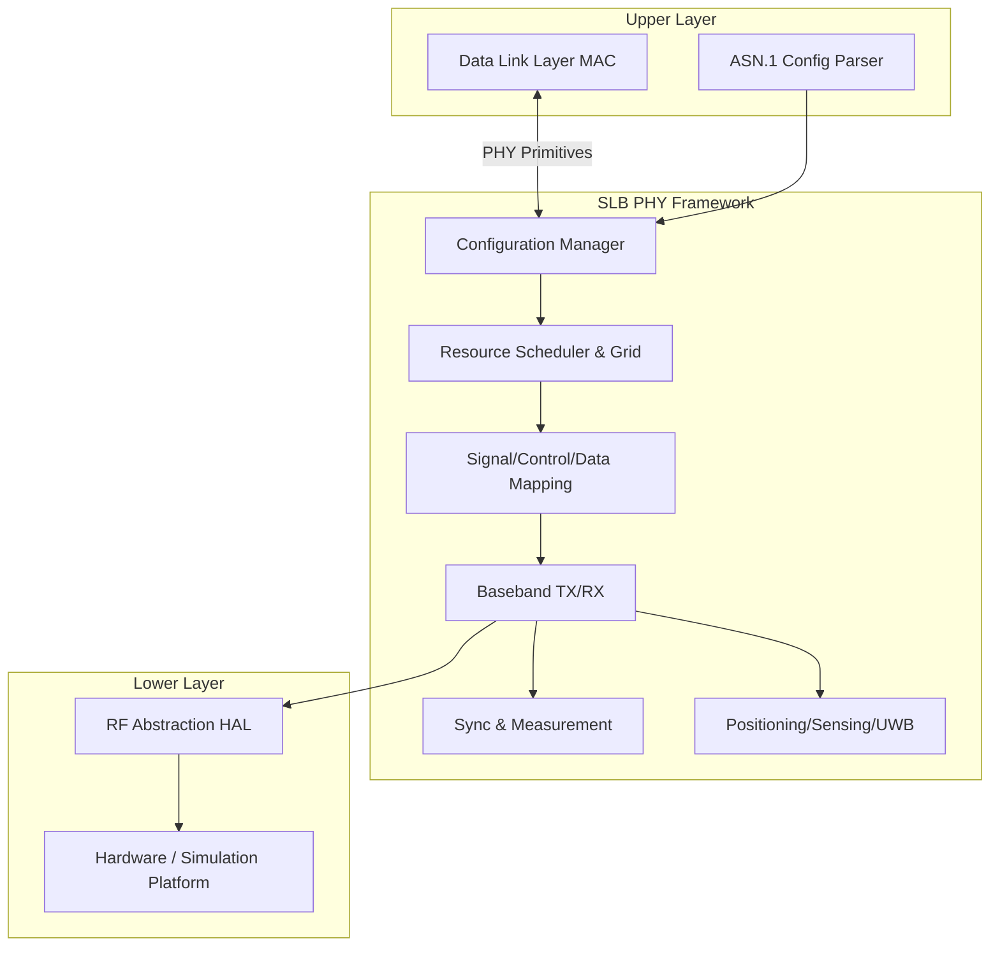
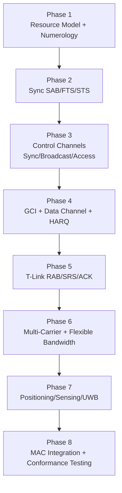

# SparkLink SLB Physical Layer Code Framework — Technical Document

**Standard Reference**: T/XS 10001-2025 *SparkLink Wireless Communication System — Radio Access Layer — Air-interface Synchronous Low Latency Broadband Technical Requirements and Test Methods*, V2.0.0 (2025-03-26)

**Document Version**: V1.0  
**Date**: 2026-07-03  
**Scope**: Architecture design and module partitioning for integrating SLB physical-layer requirements into an implementable software/hardware code framework

---

## Abstract

This document is based on Chapter 6 (Physical Layer) and related chapters of the T/XS 10001-2025 group standard. It systematically outlines the code framework design considerations required to implement the Synchronous Low Latency Broadband (SLB) physical layer. The SLB PHY is not a single OFDM module; it comprises multiple waveforms including **120 kHz baseline CP-OFDM**, **flexible bandwidth derivation**, **optional deep-coverage mode**, and **ultra-wideband pulse (SLP)**, and is tightly coupled with the data link layer, RF layer, security mechanisms, and conformance testing. This document provides a layered architecture, core module partitioning, interface recommendations, and a phased implementation roadmap for engineering deployment.

**Keywords**: SparkLink; SLB; Physical Layer; CP-OFDM; Code Framework; T/XS 10001-2025

---

## 1. Introduction

### 1.1 Purpose

To guide development teams in translating T/XS 10001-2025 physical-layer requirements into runnable code by clarifying architectural dimensions, module boundaries, interface contracts, and verification strategies—avoiding rework caused by inconsistent resource models, mixed waveforms, or unclear inter-layer coupling during implementation.

### 1.2 Scope of Referenced Standard

This document primarily references the following chapters:

| Chapter        | Content                                     |
| -------------- | ------------------------------------------- |
| Chapter 5      | System architecture (protocol stack)        |
| Chapter 6      | Physical layer (core)                       |
| Chapter 7      | Data link layer (PHY–MAC interface)         |
| Chapter 8      | RF requirements                             |
| Chapter 9      | Information security (PHY-related parts)    |
| Chapters 10–11 | Test setup and protocol conformance testing |

### 1.3 Terms and Abbreviations

| Abbreviation | Meaning                                                  |
| ------------ | -------------------------------------------------------- |
| SLB          | SparkLink Synchronous Low Latency Broadband              |
| SLP          | SparkLink Synchronous Link Positioning                   |
| G Node       | Grant Node; transmits scheduling information             |
| T Node       | Terminal Node; receives scheduling and transmits uplink  |
| G Link       | Grant Node → Terminal Node link                          |
| T Link       | Terminal Node → Grant Node link                          |
| FTS / STS    | First / Secondary Training Signal                        |
| SAB / RAB    | Synchronization Access Block / Random Access Block       |
| GCI          | G-Link Control Information                               |
| TTI / COT    | Transmission Time Interval / Channel Occupancy Time      |
| CP-OFDM      | Cyclic Prefix Orthogonal Frequency Division Multiplexing |

---

## 2. Standard Physical Layer Function Overview

### 2.1 Services Provided by PHY to MAC

Per Section 6.1, the physical layer provides the data link layer with:

- Transport block correctness checking and indication
- Forward Error Correction (FEC) encoding/decoding
- Hybrid Automatic Repeat Request (HARQ) soft combining
- Rate matching
- Mapping of coded information onto physical resources
- Modulation and demodulation of PHY control/data information
- Frequency and time synchronization
- Radio measurements and indication
- Multiple-Input Multiple-Output (MIMO) antenna processing
- Beamforming
- RF processing

### 2.2 Waveform and Duplex Mode

- **Primary waveform**: **CP-OFDM** with **Time Division Duplex (TDD)**
- **Reference frequency**: $f_s = 30.72\,\text{MHz}$, basic time unit $T_s = 1/f_s$
- **Baseline subcarrier spacing**: $\Delta f = f_s/256 = 120\,\text{kHz}$

### 2.3 Three Categories of Air-Interface Information and Information Blocks

| Category                | Description                    | Examples                                              |
| ----------------------- | ------------------------------ | ----------------------------------------------------- |
| PHY signals             | Do not carry higher-layer bits | FTS, STS, DMRS, SRS, CSI-RS, PAS, PMS                 |
| PHY control information | Carry control bits             | Sync info, broadcast, access, GCI, HARQ feedback, CQI |
| PHY data information    | Carry data bits                | Class-1 / Class-2 PHY data                            |

**Physical Information Blocks (PIB)**:

| Block  | Purpose                                              |
| ------ | ---------------------------------------------------- |
| SAB    | Synchronization Access Block (STS + FTS + sync info) |
| RAB    | Random Access Block                                  |
| G-PCIB | G-Link Physical Control Information Block            |
| A-PDIB | Auxiliary-Link Physical Data Information Block       |
| P-PCIB | Passthrough-Link Physical Control Information Block  |

---

## 3. Overall Code Framework Architecture

### 3.1 Design Principles

1. **Pluggable waveforms**: 120 kHz CP-OFDM, flexible bandwidth, deep-coverage SC-FDMA, and UWB pulse as parallel backends.
2. **Unified resource model**: Super frame / radio frame / TTI / COT / resource grid as global time–frequency descriptors.
3. **TX/RX symmetry**: Transmitter and receiver chains mirror each other for integration and golden-vector comparison.
4. **Configuration-driven**: Higher-layer ASN.1 configuration (XRC / system messages) maps to runtime PHY state; avoid hard-coding.
5. **Testability first**: Support golden vectors, RE-level dumps, and protocol conformance test cases from day one.

### 3.2 Recommended Directory Structure

```text
slb_phy/
├── common/          # Time base, bit order, CRC, Gold sequences
├── numerology/      # 120 kHz and flexible bandwidth parameter tables (α derivation)
├── waveform/        # CP-OFDM / SC-FDMA / UWB pulse backends
├── resource/        # Super frame, radio frame, TTI, COT, resource grid
├── signals/         # FTS/STS/DMRS/SRS/CSI-RS/PMS reference signals
├── control/         # Sync/broadcast/access/GCI/feedback control channels
├── data_path/       # Encode → modulate → map → HARQ data path
├── sync_meas/       # Sync, TA, RSRP/CQI, positioning and sensing
├── rf_abstraction/  # HAL interfacing with Chapter 8 RF requirements
├── mac_if/          # Service primitives to the data link layer
├── security/        # Secure ranging/sensing scrambling, KDF, etc.
└── test_vectors/    # Chapter 11 conformance test vectors
```

### 3.3 Architecture Diagram



---

## 4. Time and Frequency Resource Model

### 4.1 Time Structure

| Concept     | Parameter                               | Description                                        |
| ----------- | --------------------------------------- | -------------------------------------------------- |
| Super frame | $T_f = 30720 \times T_s = 1\,\text{ms}$ | 8 radio frames; indices #0–#65535 cycle            |
| Radio frame | Symbol count by type                    | Type 1A/B: 14; Type 2: 13; Type 3: 12; Type 4: 10  |
| TTI         | $2^{N_{TTI}}$ radio frames              | $N_{TTI} = 0,1,\ldots,6$                           |
| COT         | Integer radio frames                    | Channel occupancy period under non-continuous mode |

**Symbol types** (120 kHz) define different CP lengths and switching gaps (GAP); parameterize them in `NumerologyProfile`.

### 4.2 Frequency Structure

- **Baseline channel bandwidth**: 20 MHz
- **Baseline carrier**: 161 subcarriers (#0–#160); **#80 is DC and not mapped**
- **Active subcarriers**: All except DC may carry data or signals
- **Baseline subcarrier groups**: 10 consecutive subcarriers per group, 16 groups total
- **Node working carrier**: Aggregation of $N_{CH}$ baseline channels (1–32, including $N_{CH}=25$ special case)
- **Working subcarrier groups**: $L_{CH}$ mapped from $N_{CH}$ via lookup table (Standard Table 4)

### 4.3 Resource Grid API Recommendation

```text
ResourceGrid(port, carrier, frame, symbol) → RE(k, l)
RE(k, l) → complex value a[k, l]

Constraints:
  - a[80, l] ≡ 0 (DC subcarrier)
  - Unscheduled REs mapped to 0
  - Support multi-antenna port p and multi-carrier aggregation
  - G/T/A/D symbols time-multiplexed within the same radio frame
```

---

## 5. Waveform Subsystem Design

The standard PHY comprises four technical lines, implemented as **parallel subsystems**:

| Subsystem                     | Standard Section | Key Characteristics                                    |
| ----------------------------- | ---------------- | ------------------------------------------------------ |
| 120 kHz baseline CP-OFDM      | 6.2              | Main service air interface, TDD, G/T/A/D links         |
| Flexible bandwidth derivation | 6.3.2            | $\alpha = 0.125 \sim 4$, subcarrier spacing 15–480 kHz |
| Deep-coverage mode (optional) | 6.3.3            | SC-FDMA; significantly different frame structure       |
| Ultra-wideband pulse SLP      | 6.4, 6.8         | Pulse ranging/sensing; parallel to OFDM                |

### 5.1 Flexible Bandwidth Derivation Parameters

Derivation coefficient $\alpha$ is a rational number:

$$\Delta f_d = \Delta f \times \alpha = (120 \times \alpha)\,\text{kHz}$$
$$f_{s,d} = f_s \times \alpha = (30.72 \times \alpha)\,\text{MHz}$$
$$T_{s,d} = T_s / \alpha$$

| $\alpha$ | Subcarrier Spacing (kHz) | Reference Freq. (MHz) | Baseline Channel BW (MHz) |
| -------- | ------------------------ | --------------------- | ------------------------- |
| 0.125    | 15                       | 3.84                  | 2.5                       |
| 0.25     | 30                       | 7.68                  | 5                         |
| 0.5      | 60                       | 15.36                 | 10                        |
| 1        | 120                      | 30.72                 | 20                        |
| 2        | 240                      | 61.44                 | 40                        |
| 4        | 480                      | 122.88                | 80                        |

### 5.2 Waveform Backend Abstraction

```text
interface WaveformBackend {
    generate_tx_symbol(grid, symbol_idx) → time_domain_samples
    process_rx_symbol(samples, symbol_idx) → grid
}

Implementations:
  - CpOfdmBackend      // 6.2 main system
  - ScFdmaBackend      // 6.3.3 deep coverage (optional)
  - UwbPulseBackend    // 6.4 ultra-wideband pulse
```

---

## 6. PHY Signals and Control Channels

### 6.1 Synchronization Signals

| Signal | Sequence Type         | Key Parameters                                               |
| ------ | --------------------- | ------------------------------------------------------------ |
| FTS    | Zadoff–Chu (ZC) class | $u$ scenario-dependent: SAB ($u=1,160$), RAB ($u=2$), passthrough ($u=159$) |
| STS    | Comb ZC sequence      | $u = 1,2,\ldots,16$; related to lower 4 bits of G Node ID    |

**SAB structure** (communication domain): #0→STS, #1/#2→FTS, #3/#4→sync information.

### 6.2 Reference Signals

| Signal   | Link        | Purpose                                 |
| -------- | ----------- | --------------------------------------- |
| G-DMRS-C | G Link      | G-link common channel demodulation      |
| T-DMRS-C | T Link      | T-link control information demodulation |
| DMRS-D   | G/T         | Data channel demodulation               |
| P-DMRS-C | Passthrough | Passthrough common demodulation         |
| SRS      | T Link      | Uplink channel sounding                 |
| CSI-RS   | G Link      | Downlink channel state                  |
| PAS      | G/T         | Data channel phase tracking             |

Pseudo-random QPSK sequence $r_{n,l}(m)$ is generated from a Gold sequence; initialization $c_{init}$ depends on frame index, symbol index, $N_{ID}$, and $N_{CP}$ (see Standard 6.5.3).

### 6.3 Main Control Channels

| Control Info   | Payload Bits     | Coding       | Typical Mapping   |
| -------------- | ---------------- | ------------ | ----------------- |
| Sync info      | 52 + CRC24       | Polar + QPSK | SAB symbols #3/#4 |
| Broadcast info | 37 + CRC24       | Polar + QPSK | Symbols #5/#7     |
| Access info    | 56 + CRC24       | Polar + QPSK | RAB symbols #3/#4 |
| GCI            | Multiple formats | Polar + QPSK | G-PCIB            |

GCI supports multiple formats: dynamic scheduling, preconfigured scheduling activation/deactivation, sleep/wake, carrier switching, positioning resource indication, etc. CRC is scrambled with a 24-bit Physical Layer Identity (PID).

---

## 7. Baseband Processing Pipeline

### 7.1 Transmit Chain

```text
Higher-layer bits
  → CRC (CRC24A/B, CRC16, CRC8, CRC6)
  → Channel coding (Polar code, 6.2.6)
  → Rate matching
  → Scrambling
  → Modulation (QPSK / QAM, MCS tables)
  → RE mapping (with DMRS/PAS insertion)
  → Multi-port / MIMO / beamforming
  → IFFT
  → CP insertion
  → Multi-carrier synthesis
  → Up-conversion (6.2.10)
```

### 7.2 Receive Chain

```text
Down-conversion
  → CP removal
  → FFT
  → Channel estimation (FTS/STS/DMRS)
  → Equalization
  → Demodulation
  → Descrambling
  → Rate de-matching
  → Polar decoding
  → CRC check
  → Report to MAC (TB + check result)
```

### 7.3 Baseband Signal Generation (Standard 6.2.9)

Time-domain continuous signal for antenna port $p$, symbol $l$:

$$s_l^{(p)}(t) = \sum_{k=0}^{160} a_{k,l}^{(p)} \cdot e^{j2\pi(k-80)\Delta f (t - T_{CP} - t_{start,l})}$$

where $t_{start,l} \leq t < t_{start,l} + T_{Symb}$.

### 7.4 HARQ

- MAC-side HARQ entity supports up to **4 processes** (8 optional in deep-coverage mode)
- TB-level and CBG-level retransmission supported
- Redundancy versions RV0–RV3
- PHY must provide soft-bit buffers and combining interface

---

## 8. Synchronization and Timing Management

### 8.1 Sync Engine Module

```text
sync_engine/
├── coarse_sync()    # FTS correlation peak detection
├── fine_sync()      # STS fine sync and frequency offset estimation
├── frame_tracker()  # Super frame / radio frame number tracking (GFN/HFN)
├── ta_controller()  # Timing Advance closed-loop control
└── multi_domain()   # Multi-domain sync tracking (250 μs periodic detection)
```

### 8.2 Timing Advance (TA)

T Node uplink transmission must adjust transmit timing per G Node TA indication, coordinated with RAB access and `timingAdvanceInfo` in XRC configuration.

### 8.3 Transmission Modes

| Mode                        | Characteristics                                              |
| --------------------------- | ------------------------------------------------------------ |
| Continuous transmission     | Super frame and TTI boundaries aligned; periodic SAB/broadcast |
| Non-continuous transmission | COT-based contention; SAB at COT start; RAB optionally at COT end |

---

## 9. Node Roles and Link Types

### 9.1 Node Roles

| Role   | Responsibilities                                          |
| ------ | --------------------------------------------------------- |
| G Node | Scheduling, broadcast, receiving T-link data and feedback |
| T Node | Access, uplink transmission, ACK/CQI/SR feedback          |

The framework must support **role mode switching** (G/T/dual-mode) and **communication domain** context management.

### 9.2 Link Types

| Link               | Direction  | Typical Content                               |
| ------------------ | ---------- | --------------------------------------------- |
| G Link             | G → T      | Broadcast, GCI, downlink data, CSI-RS         |
| T Link             | T → G      | RAB, SRS, uplink data, ACK/CQI/SR             |
| Auxiliary Link A   | T → T(+G)  | Inter-T-node auxiliary data                   |
| Passthrough Link D | Contention | Unconnected node communication (SAB + P-PCIB) |

---

## 10. PHY–MAC Layer Interface

### 10.1 Services Expected by MAC from PHY (Standard 7.2)

- Data transport service
- HARQ feedback signals
- Measurement results

### 10.2 Recommended Primitive Definitions

**MAC → PHY:**

| Primitive             | Description                                             |
| --------------------- | ------------------------------------------------------- |
| `PHY_CONFIG_REQ`      | PHY configuration from XRC / system messages            |
| `PHY_SCH_REQ`         | Scheduling request: TB + GCI + time/frequency resources |
| `PHY_RACH_REQ`        | Random access / RAB transmission                        |
| `PHY_MEAS_CONFIG_REQ` | Measurement / positioning / sensing configuration       |

**PHY → MAC:**

| Primitive         | Description                           |
| ----------------- | ------------------------------------- |
| `PHY_DATA_IND`    | Demodulated transport block           |
| `PHY_CRC_IND`     | CRC check result                      |
| `PHY_HARQ_FB_IND` | ACK/NACK feedback                     |
| `PHY_MEAS_IND`    | RSRP/CQI/CSI/positioning measurements |
| `PHY_SYNC_IND`    | Synchronization state change          |
| `PHY_ERROR_IND`   | Error indication                      |

### 10.3 Configuration Sources

Most PHY parameters come from ASN.1 PER-encoded XRC signaling (Standard 7.5), including:

- `PhysicalConfigDedicated`
- `dmrs-D-GLinkDataSetConf` / `dmrs-D-TLinkDataSetConf`
- `srs-Set-Conf` / `csi-RS-Set-Conf`
- `dedicatedACK-ResourceSetConf`
- `timingAdvanceInfo` / `p0-NominalConfig`

Establish a mapping table from **ASN.1 configuration fields → runtime PHY state**.

---

## 11. Measurement, Positioning, and Sensing

### 11.1 Routine Measurements (6.5.5)

| Measurement | Definition                                                   |
| ----------- | ------------------------------------------------------------ |
| RSRP        | Linear average of received power on active subcarriers in FTS symbol |
| RSSI        | Total received power within symbol duration (including interference and noise) |
| RSRQ        | RSRP / RSSI                                                  |
| SINR        | RSRP / (RSSI − RSRP)                                         |
| CBRA        | Channel busy ratio (thresholds −87 dBm / −62 dBm)            |

### 11.2 OFDM Positioning (6.6)

- **RTT ranging**: Two-way two-message / three-message
- **FLAG modes**: M2M-FLAG, DL-FLAG, SUL-FLAG, AUL-FLAG
- **Frequency-hopping ranging**: Multi-carrier channel estimation and two-way composite channel
- **Secure ranging**: KDF-based frequency-domain scrambling of CSI-RS/SRS

### 11.3 Sensing Measurements (6.7)

- Multi-antenna time-division transmission with scrambling for privacy
- Scrambling synchronization: Method 1 (secret parameters + Hermite interpolation), Method 2 (direct configuration)

### 11.4 Ultra-Wideband Pulse Measurements (6.4, 6.8)

- Independent frame structure and chip sequences (max pulse repetition frequency 499.2 MHz)
- Measurements: RTT, AoA/AoD, Channel Impulse Response (CIR), range-Doppler
- Multi-antenna sub-segment switching and random antenna-pair ordering

**Recommendation**: Decouple `positioning/` and `sensing/` from the traffic data path; share time base and configuration management.

---

## 12. Power Control and RF Abstraction

### 12.1 Power Control (6.5.4)

T Node transmit power:

$$P = 10\log_{10}(M) + P_0 + PL$$

where $M$ is the number of occupied subcarriers and $PL = \text{gLinkReferenceSignalPower} - \text{RSRP}$.

Different channel types map to different $P_0$ configuration items: `srs-P0`, `rach-P0`, `ack-P0`, `data-Class1-P0`, `data-Class2-P0`.

### 12.2 RF Abstraction Layer

Even for baseband-only simulation, reserve interfaces aligned with Chapter 8:

- Channel number and center frequency (8.3)
- Band and bandwidth configuration (8.1, 8.2)
- Transmit power and spectrum mask (8.4)
- Receiver sensitivity and blocking requirements (8.5)

```text
interface RfHal {
    tx(samples, carrier_freq, power_dbm)
    rx(carrier_freq, num_samples) → samples
    set_tx_power(power_dbm)
    set_carrier_freq(freq_hz)
}
```

---

## 13. Security-Related PHY Logic

PHY mechanisms directly involving security (cross-referencing Chapter 9):

| Scenario                       | Mechanism                                                    |
| ------------------------------ | ------------------------------------------------------------ |
| Secure positioning measurement | KDF-generated random sequence; bit-wise XOR scrambling of CSI-RS/SRS |
| Secure sensing                 | Scrambling phase $\rho_i(k,n)$ with multi-antenna matrix transmission |
| UWB measurement security       | Secure random seed for antenna-pair random ordering          |

Recommend a standalone `security/` module providing KDF, key handles, and interfaces to MAC security context negotiation.

---

## 14. Bit Order and Numerical Conventions

Standard conventions (6.1) must be applied globally:

1. **LSB first**: $b_0$ is the least significant bit and is transmitted first on the air interface.
2. **Byte LSB first**: Multi-byte sequences are transmitted in ascending byte order.
3. **CSI feedback encoding**: 12-bit signed IQ linear value + 12-bit RPL reference value jointly encoded.
4. **Time durations**: All are integer multiples of $T_s$.

Fixed-point implementations must unify FFT/IFFT scaling, LLR bit width, and correlation peak detection thresholds.

---

## 15. Test and Verification Architecture

### 15.1 Test Levels

| Level                 | Content                                                     | Standard Reference |
| --------------------- | ----------------------------------------------------------- | ------------------ |
| Unit tests            | CRC, Gold sequence, FTS/STS, Polar codec                    | 6.5, 6.2.6         |
| Golden vectors        | Bit/symbol point-by-point comparison with standard examples | Annexes            |
| Link-level simulation | AWGN/multipath, BLER vs SNR                                 | —                  |
| Protocol flow tests   | Sync, access, scheduling, HARQ, positioning                 | 11.1               |
| RF conformance        | TX/RX metrics                                               | Chapter 12         |

### 15.2 Observability Requirements

- RE-level frequency/time domain dumps
- Constellation and spectrum output
- Sync metrics (correlation peak, frequency offset estimate)
- Scheduling timeline visualization (Gantt chart)

---

## 16. Phased Implementation Roadmap



### 16.1 Minimum Viable Product (MVP)

- 120 kHz, single carrier
- G Node SAB broadcast + T Node RAB access
- Single downlink scheduling + ACK feedback

### 16.2 Full SLB PHY

Incrementally add on MVP: multi-carrier, CBG HARQ, auxiliary/passthrough links, FLAG positioning, UWB pulse measurement.

---

## 17. Technology Selection Recommendations

| Module           | Recommendation                                               |
| ---------------- | ------------------------------------------------------------ |
| Language         | C/C++ (real-time path) + Python/MATLAB (algorithm validation) |
| Polar code       | Reference 3GPP Polar implementation, trimmed per standard parameter tables |
| FFT              | FFTW / kissfft / custom fixed-point FFT                      |
| Concurrency      | G Node: scheduler thread + TX/RX real-time threads; strict frame timing |
| Configuration    | ASN.1 compiler-generated structs; JSON intermediate layer for simulation |
| Hardware mapping | Reserve FPGA DMA / bare-metal / SDR interfaces               |

---

## 18. Framework Checklist

When implementing the SLB PHY code framework, at minimum cover:

| #    | Dimension                      | Key Points                                                   |
| ---- | ------------------------------ | ------------------------------------------------------------ |
| 1    | Multiple waveforms             | 120 kHz CP-OFDM, flexible bandwidth, deep coverage, UWB pulse |
| 2    | Unified resource model         | Super frame / frame / TTI / COT / multi-carrier RE grid      |
| 3    | Three air-interface info types | Signal / control / data + PIB mapping                        |
| 4    | Complete baseband chain        | Polar code + HARQ + modulation + MIMO                        |
| 5    | Sync and timing                | FTS/STS/TA/multi-domain sync                                 |
| 6    | Nodes and links                | G/T roles; G/T/A/D four link types                           |
| 7    | Inter-layer interface          | PHY–MAC primitives + ASN.1 config mapping                    |
| 8    | Measurement extensions         | Routine + positioning + sensing + UWB                        |
| 9    | Power and RF                   | Power control formula + RF HAL abstraction                   |
| 10   | Security                       | Secure ranging/sensing scrambling                            |
| 11   | Numerical conventions          | Bit order, fixed-point scaling, CSI encoding                 |
| 12   | Testing                        | Golden vectors + protocol conformance + observability        |

---

## References

1. T/XS 10001-2025, *SparkLink Wireless Communication System — Radio Access Layer — Air-interface Synchronous Low Latency Broadband Technical Requirements and Test Methods*, SparkLink Alliance, 2025-03-26.
2. GB/T 33133.2-2021, *Information Security Technology — ZUC Stream Cipher Algorithm — Part 2: Confidentiality Algorithm*.
3. ITU-T X.691, ASN.1 Packed Encoding Rules (PER).

---

## Revision History

| Version | Date       | Changes         |
| ------- | ---------- | --------------- |
| V1.0    | 2026-07-03 | Initial release |
