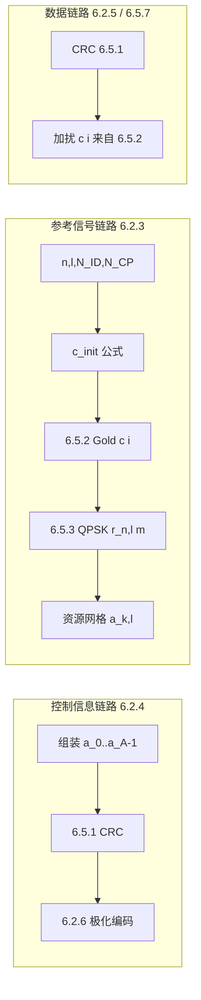

# 星闪 SLB 物理层 6.5.1～6.5.3 共性基础算法技术文档

**标准依据**：T/XS 10001-2025《星闪无线通信系统 接入层 同步低时延宽带空口 SLB 技术要求和测试方法》（团体标准 20250326 版）  
**适用章节**：6.5.1 循环冗余校验、6.5.2 伪随机序列、6.5.3 伪随机 QPSK 序列  
**代码文件**：`slb_phy_common.h` / `slb_phy_common.c`（全局复用，无静态全局状态）

---

## 1. 文档目的与三节关系

SLB 120 kHz 物理层中，控制信息、参考信号、比特加扰等多条链路都依赖同一套“底层序列/校验”算法。6.5.1～6.5.3 不规定具体业务内容，只规定**怎么算**这些基础比特/符号序列。

| 节号 | 名称 | 输入 | 输出 | 典型链路用途 |
|------|------|------|------|--------------|
| **6.5.1** | 循环冗余校验 CRC | `A` 个信息比特 + 多项式 `g(D)` | `B=A+L` 个比特 | SAB、HARQ-ACK、CQI、GCI、数据 TB 等差错检测 |
| **6.5.2** | 伪随机 Gold 序列 | `c_init`, `M_PN` | `c(0)…c(M_PN-1)` | 6.5.3 QPSK 参考信号、6.5.7 加扰、6.5.9.1 序列组跳 |
| **6.5.3** | 伪随机 QPSK 序列 | `n,l,N_ID,N_CP` | `r_{n,l}(0)…r_{n,l}(160)` | SRS、CSI-RS、DMRS、PAS、T 链路 ACK 序列传输等 |



**推荐复用策略**：工程上只维护一份 `slb_phy_common` 库；各链路模块仅传入不同的 `A`、`g(D)`、`c_init` 或 `N_ID` 等参数。

---

## 2. 6.5.1 循环冗余校验（CRC）

### 2.1 标准定义摘要

- **输入信息比特**：`a_0, a_1, …, a_{A-1}`（`A` 为信息比特数，含预留位）
- **校验比特**：`p_0, …, p_{L-1}`（`L` 由所选多项式决定）
- **编码输出**：`b_0, …, b_{B-1}`，`B = A + L`

**整除条件**（GF(2)）：多项式  
`T(D) = a_0 D^{A+L-1} + … + a_{A-1} D^L + p_0 D^{L-1} + … + p_{L-1}`  
能被所选 `g(D)` 整除。

**系统码输出关系**（无掩码）：

```
b_k = a_k,           k = 0, 1, …, A-1
b_k = p_{k-A},       k = A, A+1, …, A+L-1
```

**带掩码**（仅 `L=24` 场景，标准 6.5.1）：

```
b_k = a_k,                              k = 0, …, A-1
b_k = (p_{k-A} + x_MASK,k-A) mod 2,     k = A, …, A+L-1
```

### 2.2 五种生成多项式

| 枚举 `slb_crc_poly_t` | 生成多项式 g(D) | L |
|------------------------|-----------------|---|
| `SLB_CRC24A` | D^24+D^23+D^18+D^17+D^14+D^11+D^10+D^7+D^6+D^5+D^4+D^3+D+1 | 24 |
| `SLB_CRC24B` | D^24+D^23+D^21+D^20+D^17+D^15+D^13+D^12+D^8+D^4+D^2+D+1 | 24 |
| `SLB_CRC16` | D^16+D^12+D^5+1 | 16 |
| `SLB_CRC8`  | D^8+D^6+D^5+D^3+1 | 8 |
| `SLB_CRC6`  | D^6+D^5+1 | 6 |

120 kHz 系统中大量控制块使用 **CRC24B**；CQI / 调度请求使用 **CRC16**；第一类数据信息可选 CRC24A / CRC16 / CRC8。

### 2.3 C 语言接口与变量

#### 编码 `slb_crc_encode`

| 变量 | 方向 | 类型 | 含义 |
|------|------|------|------|
| `a` | 输入 | `const uint8_t *` | 信息比特 `a_0…a_{A-1}`，每元素 0/1 |
| `A` | 输入 | `uint32_t` | 信息比特个数 |
| `poly` | 输入 | `slb_crc_poly_t` | CRC 多项式选择 |
| `mask` | 输入 | `const uint8_t *` 或 `NULL` | 24 bit 掩码；`NULL` 表示不加掩码 |
| `b` | 输出 | `uint8_t *` | 编码比特 `b_0…b_{B-1}` |
| `b_cap` | 输入 | `uint32_t` | `b` 缓冲区容量，须 ≥ `A + L` |

#### 校验 `slb_crc_check`

| 变量 | 方向 | 类型 | 含义 |
|------|------|------|------|
| `b` | 输入 | `const uint8_t *` | 接收比特流（信息+CRC，含掩码后） |
| `B` | 输入 | `uint32_t` | 总比特数 |
| `poly` | 输入 | `slb_crc_poly_t` | 与发送端一致 |
| `mask` | 输入 | `const uint8_t *` 或 `NULL` | 发送端掩码 |
| `pass` | 输出 | `uint8_t` | `1`=CRC 通过，`0`=失败 |

#### 示例：通信域 SAB（52 有效 + 4 预留 + CRC24）

```c
#include "slb_phy_common.h"

uint8_t sab_info[56];   /* 由 6.2.4.1.1 按 LSB→MSB 组装，含 4 预留 0 */
uint8_t sab_out[80];

slb_crc_encode_t enc = {
    .a      = sab_info,
    .A      = 56,
    .poly   = SLB_CRC24B,
    .mask   = NULL,
    .b      = sab_out,
    .b_cap  = 80
};
slb_crc_encode(&enc);   /* sab_out[0..55]=信息, sab_out[56..79]=CRC24 */
```

#### 示例：带 24 bit 掩码的预配置调度激活去激活信息

```c
uint8_t mask24[24];     /* 高层 newphy-IDforPreConfig，每比特 0/1 */
slb_crc_encode_t enc = {
    .a = info52, .A = 58, .poly = SLB_CRC24B,
    .mask = mask24, .b = out82, .b_cap = 82
};
slb_crc_encode(&enc);
```

**实现注意**：必须先按 6.2.4 各子节“从最低位到最高位”组装比特流，再调用 CRC；预留位即使恒为 0 也参与计算。

---

## 3. 6.5.2 伪随机序列（31 阶 Gold 序列）

### 3.1 标准定义摘要

长度为 `M_PN` 的序列 `c(i)`，`i = 0, 1, …, M_PN-1`：

```
c(i) = ( x1(i+1600) + x2(i+1600) ) mod 2

x1(i+31) = ( x1(i+3) + x1(i) ) mod 2
x2(i+31) = ( x2(i+3) + x2(i+2) + x2(i+1) + x2(i) ) mod 2
```

**初始化**：

- 第一 m 序列：`x1(0)=1`，`x1(i)=0`，`i=1…30`
- 第二 m 序列：`c_init = Σ_{i=0}^{30} x2(i)·2^i`（`x2(i)` 为 `c_init` 二进制第 `i` 位，LSB 对应 `i=0`）

**1600 偏移**：使用 `x1(i+1600)`、`x2(i+1600)` 而非 `i=0` 起始，跳过 m 序列瞬态（与 3GPP 系列一致）。

**x1 预计算优化**：第一 m 序列 `x1` 的初态固定（`x1(0)=1`，`x1(1…30)=0`），与 `c_init` 无关，因此 `x1` 的递推结果完全确定。其中前 1600 个输出 `x1(0)…x1(1599)` 以及输出段所需的 `x1(1600)…x1(1600+M_PN-1)` 均可在编译期或模块初始化时一次性生成并固化为常量表（例如 `static const uint8_t x1_pre[]`）。运行时只需对 `x2` 执行 `1600 + M_PN` 次 LFSR 递推，再与预存的 `x1(i+1600)` 模 2 相加即可；每次调用可节省 1600 次 `x1` LFSR 迭代，输出与标准逐步递推完全一致。

### 3.2 C 语言接口与变量

#### `slb_pn_gold_generate`

| 变量 | 方向 | 类型 | 含义 |
|------|------|------|------|
| `c_init` | 输入 | `uint32_t` | Gold 初始化整数 |
| `M_PN` | 输入 | `uint32_t` | 所需序列长度 |
| `c` | 输出 | `uint8_t *` | `c(0)…c(M_PN-1)`，每元素 0/1 |
| `c_cap` | 输入 | `uint32_t` | 缓冲区容量，须 ≥ `M_PN` |

#### 不同链路的 `c_init` 公式（调用方计算后传入）

| 场景 | 标准节 | c_init 公式 |
|------|--------|-------------|
| 伪随机 QPSK 参考信号 | 6.5.3 | `2^10·(15·(n+1)+l+1)·(4·N_ID+1) + 4·N_ID + N_CP` |
| 比特加扰 | 6.5.7 | `n_f·2^24 + N_G-PID` |
| ZC 序列组跳 | 6.5.9.1 | `⌊n_ID^X / 30⌋` |

#### 示例：任意长度加扰序列（配合 6.5.7）

```c
uint32_t c_init = ((uint32_t)n_f << 24) | N_G_PID;
uint8_t c[M_PN];

slb_pn_seq_t pn = { .c_init = c_init, .M_PN = M_PN, .c = c, .c_cap = M_PN };
slb_pn_gold_generate(&pn);

/* 加扰：t̃_i = (t_i + c(i)) mod 2 */
for (uint32_t i = 0; i < K; i++)
    t_tilde[i] = (t[i] + c[i]) & 1U;
```

---

## 4. 6.5.3 伪随机 QPSK 序列

### 4.1 标准定义摘要

**QPSK 映射**（`m = 0, 1, …, 160`）：

```
r_{n,l}(m) = (1/√2)·(2·c(2m)-1) + j·(1/√2)·(2·c(2m+1)-1)
```

| c(2m) | c(2m+1) | r_{n,l}(m) |
|-------|---------|------------|
| 0 | 0 | (-1-j)/√2 |
| 0 | 1 | (-1+j)/√2 |
| 1 | 0 | (+1-j)/√2 |
| 1 | 1 | (+1+j)/√2 |

**c_init**（6.5.3）：

```
c_init = 2^10 · (15·(n+1) + l + 1) · (4·N_ID + 1) + 4·N_ID + N_CP
```

| 参数 | 含义 | 取值 |
|------|------|------|
| `n` | 超帧内无线帧号 | `n = 0, 1, …, 7` |
| `N_ID` | G 节点标识低 8 位 | `0…255` |

通信域 CP-OFDM 符号类型与 `l`、`N_CP` 的对应关系：

| CP-OFDM 符号类型 | 符号编号 `l` | `N_CP` | 说明 |
|------------------|--------------|--------|------|
| 类型一 A 或类型一 B | `l = 0, 1, …, 13` | 3 | 每无线帧 14 个符号 |
| 类型二 | `l = 0, 1, …, 12` | 2 | 每无线帧 13 个符号 |
| 类型三 | `l = 0, 1, …, 11` | 1 | 每无线帧 12 个符号 |
| 类型四 | `l = 0, 1, …, 9` | 0 | 每无线帧 10 个符号 |

`N_CP ∈ {0, 1, 2, 3}` 表示通信域使用的循环前缀类型；`N_CP = 3` 对应类型一 A/B，`N_CP = 2` 对应类型二，`N_CP = 1` 对应类型三，`N_CP = 0` 对应类型四。

**所需 Gold 长度**：161 子载波 × 2 bit/符号 = **`M_PN = 322`**。

**资源映射**（6.2.3 通用）：`a_{k,l} = r_{n,l}(k)`（`k≠80`）；DC 子载波 `k=80` 置零。

### 4.2 C 语言接口与变量

#### `slb_qpsk_calc_cinit`

| 变量 | 方向 | 类型 | 含义 |
|------|------|------|------|
| `param.n` | 输入 | `uint8_t` | 无线帧号 n |
| `param.l` | 输入 | `uint8_t` | 符号号 l |
| `param.N_ID` | 输入 | `uint8_t` | G 节点 ID 低 8 位 |
| `param.N_CP` | 输入 | `uint8_t` | CP 类型 |
| **返回值** | 输出 | `uint32_t` | `c_init` |

#### `slb_qpsk_ref_generate`

| 变量 | 方向 | 类型 | 含义 |
|------|------|------|------|
| `param` | 输入 | `slb_qpsk_cinit_param_t` | 时频/小区参数 |
| `r` | 输出 | `slb_cpx_f32_t *` | 161 个 QPSK 符号，`re/im` 浮点 |
| `r_cap` | 输入 | `uint32_t` | 须 ≥ `SLB_QPSK_NUM_SUBCARRIERS` (161) |

#### `slb_qpsk_map_to_re`

| 变量 | 方向 | 类型 | 含义 |
|------|------|------|------|
| `r` | 输入 | `const slb_cpx_f32_t *` | 完整 `r_{n,l}(0…160)` |
| `a_kl` | 输出 | `slb_cpx_f32_t *` | 子载波 k 上的 RE 值 |
| `k` | 输入 | `uint32_t` | 子载波索引 0…160 |

#### 示例：生成 DMRS/CSI-RS 参考序列

```c
slb_qpsk_cinit_param_t param = {
    .n     = 0,      /* 超帧内 #0 无线帧 */
    .l     = 6,      /* 例如 G-DMRS-C 所在符号 */
    .N_ID  = g_id & 0xFF,
    .N_CP  = 3       /* 类型一 A：14 符号/帧 */
};
slb_cpx_f32_t r[SLB_QPSK_NUM_SUBCARRIERS];
slb_qpsk_seq_t q = { .param = param, .r = r, .r_cap = 161 };
slb_qpsk_ref_generate(&q);

/* 映射到资源网格 */
for (uint32_t k = 0; k < 161; k++) {
    slb_cpx_f32_t a;
    slb_qpsk_map_to_re(r, &a, k);
    /* grid[k][l] = a;  k=80 时 a=(0,0) */
}
```

#### 标准算例验证（n=0, l=0, N_ID=5, N_CP=3）

```
c_init = 1024 × 16 × 21 + 4×5 + 3 = 344087
c(0..4) = 0, 1, 1, 1, 0
```

本库 `slb_phy_common_test.c` 含上述 Gold 序列自检。

---

## 5. 链路调用对照表

| 链路/信息块 | 标准位置 | 6.5.1 | 6.5.2 | 6.5.3 |
|-------------|----------|-------|-------|-------|
| 通信域 SAB | 6.2.4.1.1 | CRC24B | — | — |
| 直通链路同步信息 | 6.2.4.1.1 | CRC24B | — | — |
| HARQ-ACK / GCI | 6.2.4.6 / 6.2.4.10 | CRC24B + 可选 Phy-ID 掩码 | — | — |
| CQI / 调度请求 SR | 6.2.4.10.3/4 | CRC16 | — | — |
| 第二类数据 TB | 6.2.5.3 | CRC24A | — | — |
| 第一类数据 | 6.2.5.2.2 | CRC24A/16/8 | 6.5.7 加扰 | — |
| SRS / CSI-RS / DMRS | 6.2.3 | — | c(i) 内部 | r_{n,l}(k) |
| T 链路 ACK（序列方式） | 6.2.4.10.6 | — | c(i) 内部 | ±r_{n,l}(k) |
| 极化码块分段 CRC | 6.2.6.1.1 | CRC24B 对码块段 | — | — |

---

## 6. 工程集成说明

### 6.1 文件结构

```
20260623-6.5.1-6.5.3-CRC与伪随机序列/
├── slb_phy_common.h          /* 公共头文件：类型、常量、API */
├── slb_phy_common.c          /* 实现：无全局可变状态，可重入 */
├── slb_phy_common_test.c     /* 自检程序 */
└── SLB物理层6.5.1-6.5.3共性基础算法技术文档.md  /* 本文档 */
```

### 6.2 编译

```bash
cc -std=c99 -Wall -Wextra -c slb_phy_common.c -o slb_phy_common.o
# 链接到物理层工程
cc your_phy_module.c slb_phy_common.o -o your_phy_app

# 运行自检
cc -std=c99 slb_phy_common.c slb_phy_common_test.c -o slb_phy_common_test
./slb_phy_common_test
```

### 6.3 设计约束

1. **比特顺序**：所有 `a[]`、`b[]`、`c[]` 数组下标 0 对应标准公式中下标 0（LSB 字段先组装）。
2. **线程安全**：函数不修改静态全局变量，多线程可并行调用（输出缓冲区由调用方提供）。
3. **内存**：Gold 序列长度由调用方指定；QPSK 参考信号固定 161 点；CRC 校验带掩码时使用栈上 ≤512 bit 临时缓冲，超长帧需扩展实现。
4. **x1 预计算**：`x1` 初态固定，建议将 `x1(0)…x1(1599)` 及常用 `M_PN` 下所需的 `x1(1600)…` 离线固化为只读常量表，运行时仅递推 `x2`，可显著降低 Gold 序列生成的 CPU 开销。
4. **浮点 QPSK**：当前输出 `float` 复数；若需定点 DSP，可在 `slb_qpsk_ref_generate` 后乘以 Q15 系数 `23170`（≈1/√2×32767）。

### 6.4 错误码

| 宏 | 值 | 含义 |
|----|-----|------|
| `SLB_PHY_OK` | 0 | 成功 |
| `SLB_PHY_ERR_PARAM` | -1 | 空指针或非法参数 |
| `SLB_PHY_ERR_BUF` | -2 | 输出缓冲区容量不足 |

---

## 7. 附录：三节 API 速查

```c
/* 6.5.1 */
uint32_t slb_crc_get_len(slb_crc_poly_t poly);
int slb_crc_encode(const slb_crc_encode_t *cfg);
int slb_crc_check(const slb_crc_check_t *cfg);

/* 6.5.2 */
int slb_pn_gold_generate(const slb_pn_seq_t *cfg);

/* 6.5.3 */
uint32_t slb_qpsk_calc_cinit(const slb_qpsk_cinit_param_t *param);
int slb_qpsk_ref_generate(const slb_qpsk_seq_t *cfg);
int slb_qpsk_map_to_re(const slb_cpx_f32_t *r, slb_cpx_f32_t *a_kl, uint32_t k);
```

---

*精确参数与字段定义以 T/XS 10001-2025 正式标准为准；本文档仅供 SLB 物理层实现与联调参考。*
